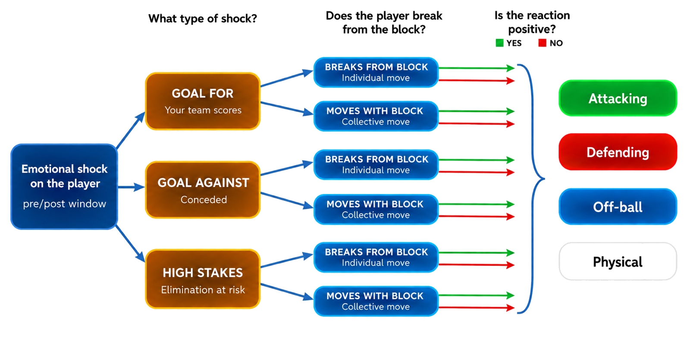
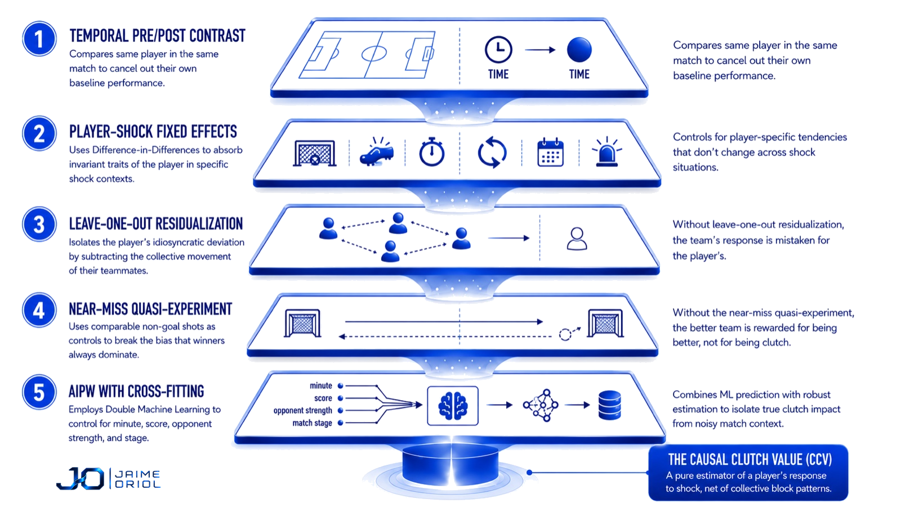
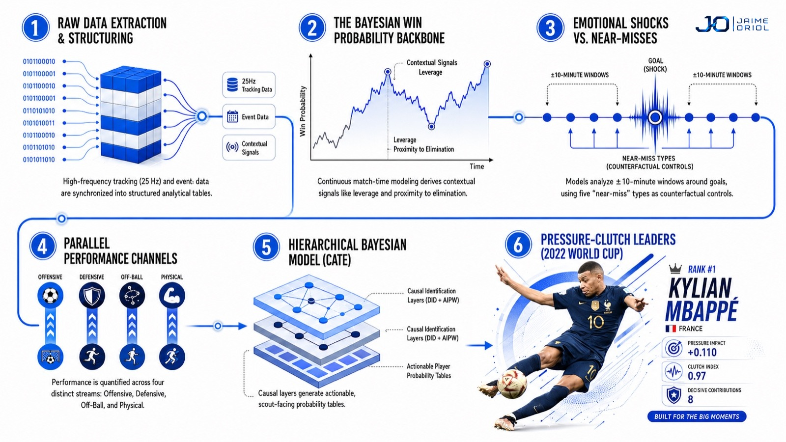

<p align="center">
  
</p>

<h1 align="center">CCV — Causal Clutch Value</h1>

<p align="center">
  <em>TFM · Máster en Big Data Aplicado al Scouting Deportivo · Sports Data Campus</em><br/>
  <em>Jaime Oriol Goicoechea</em>
</p>

---

Estimación causal del efecto del shock emocional (gol a favor / gol en contra / proximidad de eliminación) sobre el comportamiento del jugador en ventanas pre vs post de ±10 min, medido en cuatro canales (Empuje Ofensivo, Solidez Defensiva, Inteligencia Espacial Off-ball, Pulso Físico) sobre PFF FC World Cup Qatar 2022.

Output: ranking tridimensional de jugadores clutch (Indice Remontador post GA + Indice Cerrojo post GF + Pressure Response continuo en elim_prox) con intervalos de credibilidad bayesianos, agregado por bucket posicional (DEF/MED/ATA) y posicion granular (16 PFF labels).

## Pipeline conceptual y arquitectura causal

El CCV se compone de dos mapas: el **mapa conceptual** describe qué descompone (tipo de shock × ruptura del bloque × signo de la reaccion sobre 4 canales) y el **stack de 5 capas causales** describe como aisla el efecto del jugador del empuje colectivo del equipo.

<p align="center">
  
</p>

<p align="center">
  
</p>

El pipeline tecnico se ejecuta como un DAG de 6 fases: extraccion -> WP backbone -> shocks/near-miss -> 4 canales en paralelo -> CATE jerarquico -> ensamblaje scout-facing.

<p align="center">
  
</p>

## Visualizaciones

Paquete `src/viz/` genera las figuras a `outputs/viz/`:

| Figura        | Comando                                | Que muestra                                          |
|---------------|----------------------------------------|------------------------------------------------------|
| PPCF          | `python -m src.viz.ppcf`               | Pitch Control: 2-2 de Mbappe (Final, Spearman 2018)  |
| Scatter       | `python -m src.viz.scatter`            | 2 scatter globales: Remontador x Cerrojo + atk       |
| Scatter equipo| `python -m src.viz.scatter_team France`| 2 scatter de la seleccion con caras + nube torneo    |
| Radar         | `python -m src.viz radar "Messi"`      | Radar geometrico standalone (8 ejes)                 |
| Radar report  | `python -m src.viz report "Messi"`     | Radar 12 ejes + tabla percentiles (ficha scout)      |
| Event-study   | `python -m src.viz.figures`            | Efecto causal del shock minuto a minuto (M12)        |

`python -m src.viz` renderiza la BARAJA COMPLETA de una: PPCF + 2 scatter globales + 2 scatter France + 4 radar reports (Messi, Hakimi, Mbappe, Brozovic).

## Estructura del repo

```text
TFM/
├── README.md                                      # este fichero
├── run_pipeline.sh                                # E2E orquestador (auto detect cores + GPU)
├── data/parquet/
│   ├── pff/                                       # versionado: events (64) + metadata + rosters
│   └── derived/                                   # versionado: caches M03 a M14
│       ├── preprocess/, wp/, psxg/, nearmiss/, shocks/
│       ├── ataque/, defensa/, offball/, fisico/
│       ├── did/, did_validation/, aipw/
│       └── cate/                                  # M14 outputs (cate_nuts.pkl ignorado, 409 MB regenerable)
├── cache/vaep/                                    # versionado: features + labels VAEP por partido
├── src/
│   ├── extract/                                   # extractores raw a parquet (lossless)
│   ├── preprocess/pff_grades_extract.py           # priors PFF grades (input M14)
│   ├── M01_loader_pff.py                          # API PFF (events, tracking, metadata, rosters)
│   ├── M02_loader_public.py                       # API Wyscout + StatsBomb (polars nativo)
│   ├── M03_preprocess.py                          # direction, score state (SB ground truth), minutos, enrich_events
│   ├── M04_wp.py                                  # Win Probability bayesiana (numpyro SVI ordered logistic)
│   │                                              #   + leverage + ET Poisson + tanda parametrica + MC group elim_prox
│   ├── M05_psxg.py                                # Post shot xG (LightGBM + Optuna 60 + isotonic + freeze 360)
│   │                                              #   AUC OOF 0.968, holdout WC22 0.976 (vs SB 0.844)
│   ├── M05B_calibration.py                        # PSxG calibration (curve, ECE/MCE, Brier Murphy 1973)
│   ├── M06_nearmiss.py                            # Near miss 5 tipos (palo, offside 360, PSxG save, GLC, GLT)
│   ├── M07_shocks.py                              # 172 shocks gol + ventanas ±10min + LOO team_members
│   ├── M08_ataque.py                              # Empuje Ofensivo: atomic VAEP CatBoost + un xPass (Z06)
│   ├── M09_defensa.py                             # Solidez Defensiva: vdep_strict (Z04) + xpress (Z03)
│   │                                              #   + maejima (Z05) + def3rd + press_value
│   ├── M10_offball.py                             # Off ball OBSO + C OBSO (Spearman 2018 + Teranishi 2022)
│   │                                              #   PPCF Z02 + xG grid + tracking PFF 25Hz
│   ├── M11_fisico.py                              # Pulso Fisico Bradley 2024 + bayesiano jerarquico SVI
│   ├── M12_did.py                                 # DiD within player: ATE FE + Sun Abraham + BJS + HonestDiD
│   ├── M12B_validation.py                         # placebo + power + window sensitivity + stage stratified
│   ├── M13_aipw.py                                # AIPW DoubleMLIRM + DML PLR + DR learner + RDD + spec curve
│   ├── M14_cate.py                                # CATE bayesiano NUTS HMC 4 chains + 5 etas + LKJ
│   ├── M15_ccv.py                                 # tabla scout final + 16 cells contextualizados + buckets
│   ├── render_ficha.py                            # ficha visual scout facing por jugador
│   ├── Z01_vaep.py                                # atomic VAEP wrapper
│   ├── Z02_pitch_control.py                       # PPCF Spearman 2018 vectorizado
│   ├── Z03_xpress.py                              # exPress Lee 2025 P(recovery<5s|press)
│   ├── Z04_vdep.py                                # VDEP strict Toda 2022 (recovery + attacked)
│   ├── Z05_maejima.py                             # Atribución frame-level al defensor más cercano
│   ├── Z06_unxpass.py                             # un xPass Robberechts 2023 creative decision
│   └── viz/                                       # capa de visualizacion LIGHT OPTA (BG blanco, Chakra Petch)
│       ├── common.py                              # paleta, cmaps, draw_pitch, draw_header, add_logo
│       ├── ppcf.py                                # superficie Pitch Control + balon Telstar (Z02 + tracking PFF)
│       ├── scatter.py                             # 2 scatter globales: Remontador x Cerrojo + ataque tras marcar / bajo presion
│       ├── scatter_team.py                        # 2 scatter por seleccion con caras FotMob + nube del torneo
│       ├── radar.py                               # radar geometrico 8 o 12 ejes (CATEs canal x contexto)
│       ├── radar_report.py                        # radar + tabla percentiles por posicion (ficha scout)
│       ├── figures.py                             # event-study causal Sun-Abraham (M12, figura de metodo)
│       └── __main__.py                            # runner: PPCF + 4 scatter (2 global + 2 France) + 4 radar reports
├── notebooks/
│   ├── regen_all.ipynb                            # regen E2E completa M03-M15 + Z03-Z06 en orden DAG
│   └── regen_m14_kaggle.ipynb                     # regen M14 NUTS HMC en Kaggle GPU
├── outputs/
│   ├── ccv_table.parquet                          # tabla scout final (511 jug x 299 cols)
│   ├── viz/                                       # figuras PNG (PPCF, radar, radar_report, scatter, scatter_team, event-study)
│   └── ccv_aux/
│       ├── top10_chasing_per_position.parquet     # 16 position_group granulares
│       ├── top10_protecting_per_position.parquet
│       ├── top10_pressure_per_position.parquet
│       ├── top10_chasing_per_bucket.parquet       # 4 buckets (DEF/MED/ATA, GK aparte)
│       ├── top10_protecting_per_bucket.parquet
│       ├── top10_pressure_per_bucket.parquet
│       ├── dual_clutch_top.parquet
│       └── by_team.parquet
└── TFM/doc/                                       # documento TFM en LaTeX (paper EPV style, estructura RITMO)
    ├── main.tex                                   # entry point (babel ES + biblatex APA 7 + biber)
    ├── portada.tex                                # titulo ES + EN + autor + tutor + master
    ├── refs.bib                                   # BibLaTeX (citas verificadas 1 a 1 vs DOI)
    ├── Makefile                                   # make pdf | watch | clean
    ├── figures/  -> ../../outputs/viz/            # symlink
    └── sections/00..12_*.tex                      # 13 ficheros: Resumen, Abstract, Agradec., 8 caps, Refs, Anexos
```

## Estado del pipeline

E2E ejecutado al 100%. Outputs versionados en repo. Caches regenerables via `notebooks/regen_all.ipynb` o `run_pipeline.sh`.

| Modulo | Output principal                                            | Sanity verificado                                              |
|--------|-------------------------------------------------------------|----------------------------------------------------------------|
| M03    | preprocess/events_enriched/{match_id}.parquet × 64          | 144,541 filas, 172 goles SB ground truth                       |
| M04    | wp/per_minute.parquet                                       | 5,910 filas (64 partidos, minuto 1-120 con ET)                 |
| M05    | psxg/{shots,model/psxg_lgb.pkl}                             | AUC OOF 0.968, holdout WC22 0.976 (vs SB 0.844)                |
| M05B   | psxg/calibration/{curve,brier,metrics,iso}.parquet          | ECE 0.011, Brier 0.037 (vs SB 0.083)                           |
| M06    | nearmiss/nearmiss_table.parquet                             | 70 near miss (12 woodw + 5 offs + 42 save + 2 GLC + 9 GLT)     |
| M07    | shocks/{shocks_table,shocks_team_members}.parquet           | 172 shocks x ~22 jug = 3,788 filas                             |
| M08    | ataque/{per_minute,per_shock_window,model}                  | atomic VAEP + un xPass; per_minute 57,520 filas                |
| Z03    | defensa/xpress/per_minute.parquet                           | exPress Lee 2025; AUC 0.6174 (+24% baseline)                   |
| Z04    | defensa/vdep_strict/per_minute.parquet                      | VDEP Toda 2022; AUC rec 0.7950 / att 0.8308                    |
| Z05    | defensa/maejima/per_minute.parquet                          | Atribución defensor más cercano; 38.005 filas                  |
| Z06    | ataque/unxpass/per_minute.parquet                           | un xPass Robberechts 2023; AUC 0.8309                          |
| M09    | defensa/{per_minute,per_shock_window,press_value,ctx}       | score_def_v4 = vdep + xpress + maejima; 57,466 filas           |
| M10    | offball/{per_minute,per_shock_window,xg_grid}               | OBSO + C OBSO; 105,214 filas; 64 partidos a 25 Hz full         |
| M11    | fisico/{raw_per_minute,per_minute,per_shock_window,model}   | Bradley 2024 + SVI multivariate; 145,351 filas                 |
| M12    | did/{panel,ate_population,event_study,honest,diag}          | DiD within player + Sun Abraham + BJS; FE~BJS (max 4.2% SE)    |
| M12B   | did_validation/{placebo,power,window,baseline_naive,stage}  | placebo 1000 perm + BH FDR (null); window fisico-GA ~8x w3-w10 |
| M13    | aipw/{panel_master,att_aipw,att_dml_plr,att_dr_learner}     | 163 shots con jug en campo; 12,416 filas panel; AIPW+DML+DR    |
| M14    | cate/{panel_delta,posterior_player,indices,rankings,diag}   | NUTS 4x1000+1000 GPU; 0 div; 108/144 R-hat<1.05; PPC 8/8       |
| M15    | outputs/ccv_table.parquet + ccv_aux/                        | 511 jug x 299 cols + 4 buckets posicionales (GK/DEF/MED/ATA)   |

Datos raw originales (PFF tracking 5 GB, StatsBomb, Wyscout) y documentacion interna del proyecto estan fuera del repo (`.gitignore`).

## Reproducibilidad

```bash
# Clonar repo y arrancar pipeline E2E (cache hit en M03-M14 instantaneo)
git clone https://github.com/jaime-oriol/CCV.git
cd CCV
./run_pipeline.sh                # auto detect cores + GPU
# Outputs en outputs/ccv_table.parquet + ccv_aux/
```

Para regenerar desde cero (sin cache hit, requiere raw PFF + StatsBomb + Wyscout):

```bash
FORCE_CLEAN=1 ./run_pipeline.sh
```
