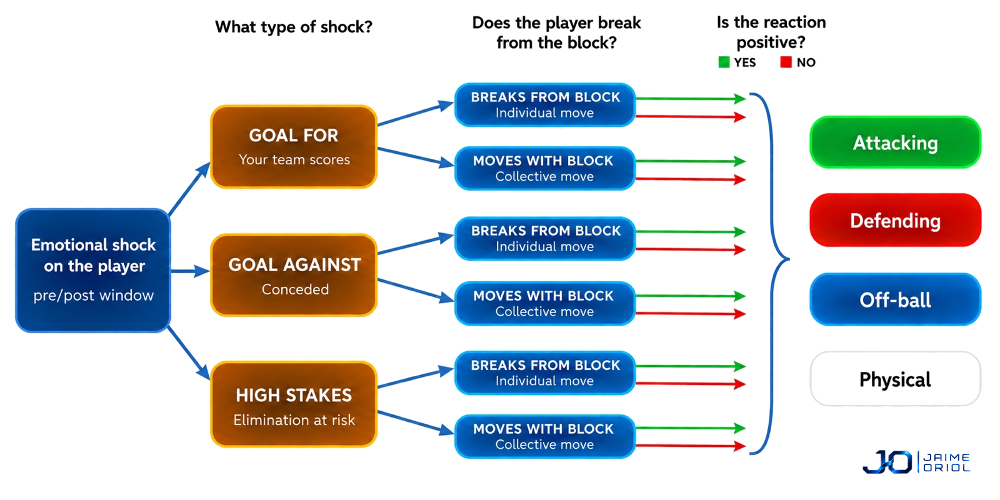
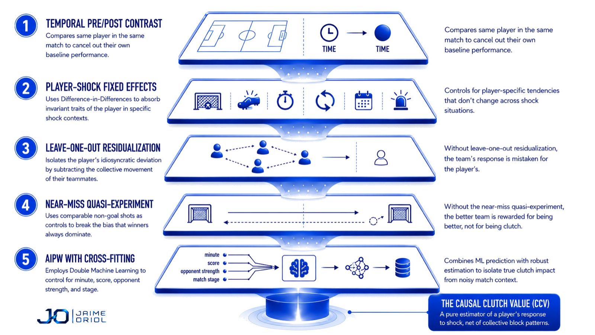
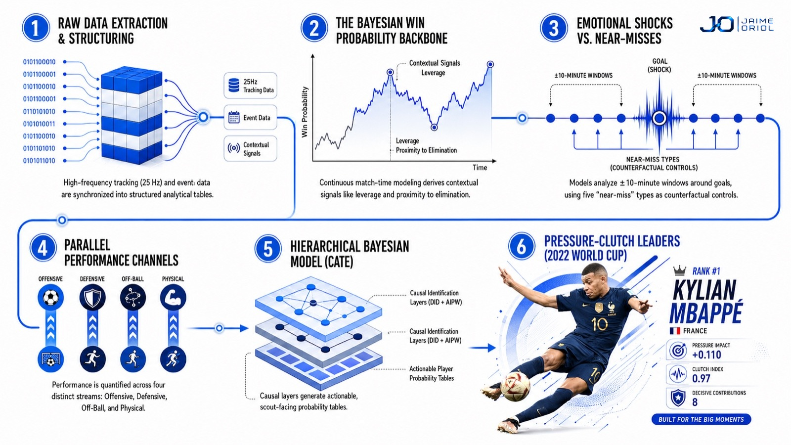
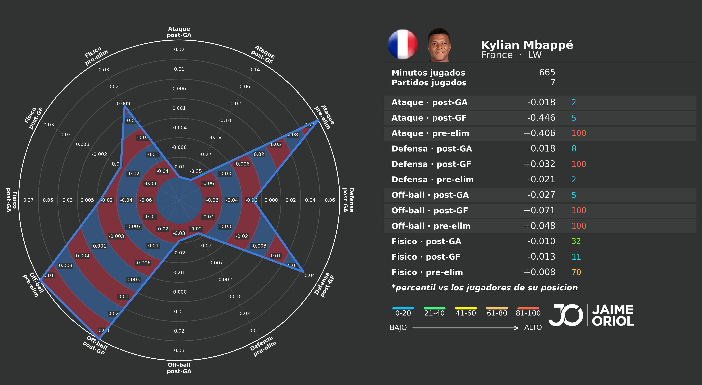

<p align="center">
  
</p>

<h1 align="center">CCV — Causal Clutch Value</h1>

<p align="center">
  <em>Causal inference of individual clutch performance in football</em><br/>
  <em>Jaime Oriol Goicoechea</em>
</p>

---

Causal estimation of the effect of an emotional shock (goal scored / goal conceded / proximity to elimination) on player behaviour over pre vs post windows of ±10 min, measured across four channels (Offensive Output, Defensive Solidity, Off-ball Spatial Intelligence, Physical Pulse) on PFF FC World Cup Qatar 2022.

Output: a three-dimensional ranking of clutch players (Chasing index post-GA + Protecting index post-GF + continuous Pressure Response on elimination proximity) with Bayesian credible intervals, aggregated by positional bucket (DEF/MED/ATA) and granular position (16 PFF labels).

## Conceptual pipeline and causal architecture

CCV rests on two maps: the **conceptual map** describes what it decomposes (shock type × breaking from the block × sign of the reaction over 4 channels) and the **5-layer causal stack** describes how it isolates the player's effect from the team's collective push.

<p align="center">
  
</p>

<p align="center">
  
</p>

The technical pipeline runs as a 6-phase DAG: extraction -> WP backbone -> shocks/near-miss -> 4 channels in parallel -> hierarchical CATE -> scout-facing assembly.

<p align="center">
  
</p>

## Scout-facing card (example)

<p align="center">
  
</p>

## Repository structure

Original raw data (PFF tracking, StatsBomb, Wyscout) and internal project documentation are kept out of the repository (`.gitignore`).

```text
CCV/
├── README.md                                      # this file
├── CCV.pdf                                        # compiled document (PDF)
├── run_pipeline.sh                                # E2E orchestrator (auto-detect cores + GPU)
├── data/parquet/
│   ├── pff/                                       # versioned: events (64) + metadata + rosters
│   └── derived/                                   # versioned: caches M03 to M14
│       ├── preprocess/, wp/, psxg/, nearmiss/, shocks/
│       ├── ataque/, defensa/, offball/, fisico/
│       ├── did/, did_validation/, aipw/, audit/
│       └── cate/                                  # M14 outputs (cate_nuts.pkl ignored, 409 MB regenerable)
├── cache/vaep/                                    # versioned: VAEP features + labels per match
├── src/
│   ├── extract/                                   # raw-to-parquet extractors (lossless)
│   ├── preprocess/pff_grades_extract.py           # PFF grade priors (input to M14)
│   ├── M01_loader_pff.py                          # PFF API (events, tracking, metadata, rosters)
│   ├── M02_loader_public.py                       # Wyscout + StatsBomb API (native polars)
│   ├── M03_preprocess.py                          # direction, score state (SB ground truth), minutes, enrich_events
│   ├── M04_wp.py                                  # Bayesian Win Probability (numpyro SVI ordered logistic)
│   │                                              #   + leverage + ET Poisson + parametric shoot-out + MC group elim_prox
│   ├── M05_psxg.py                                # Post-shot xG (LightGBM + Optuna 60 + isotonic + 360 freeze)
│   │                                              #   AUC OOF 0.968, holdout WC22 0.976 (vs SB 0.844)
│   ├── M05B_calibration.py                        # PSxG calibration (curve, ECE/MCE, Brier Murphy 1973)
│   ├── M06_nearmiss.py                            # Near-miss 5 types (woodwork, offside 360, PSxG save, GLC, GLT)
│   ├── M07_shocks.py                              # 172 goal shocks + ±10min windows + LOO team_members
│   ├── M08_ataque.py                              # Offensive Output: atomic VAEP CatBoost + un-xPass (Z06)
│   ├── M09_defensa.py                             # Defensive Solidity: vdep_strict (Z04) + xpress (Z03)
│   │                                              #   + nearest-defender (Z05) + def3rd + press_value
│   ├── M10_offball.py                             # Off-ball OBSO + C-OBSO (Spearman 2018 + Teranishi 2023)
│   │                                              #   PPCF Z02 + xG grid + PFF tracking 25Hz
│   ├── M11_fisico.py                              # Physical Pulse Bradley 2024 + hierarchical Bayesian SVI
│   ├── M12_did.py                                 # DiD within-player: ATE FE + Sun-Abraham + BJS + HonestDiD
│   ├── M12B_validation.py                         # placebo + power + window sensitivity + stage stratified
│   ├── M13_aipw.py                                # AIPW DoubleMLIRM + DML PLR + DR-learner + RDD + spec curve
│   ├── M14_cate.py                                # Bayesian CATE NUTS HMC 4 chains + 5 etas + LKJ
│   ├── M15_ccv.py                                 # final scout table + 16 contextualized cells + buckets
│   ├── audit_models.py                            # 100% audit of predictive models (PSxG/VAEP/VDEP/exPress/unxPass)
│   ├── render_ficha.py                            # visual scout-facing card per player
│   ├── Z01_vaep.py                                # atomic VAEP wrapper
│   ├── Z02_pitch_control.py                       # PPCF Spearman 2018 vectorized
│   ├── Z03_xpress.py                              # exPress Lee 2025 P(recovery<5s|press)
│   ├── Z04_vdep.py                                # VDEP strict Toda 2022 (recovery + attacked)
│   ├── Z05_maejima.py                             # frame-level attribution to the nearest defender
│   └── Z06_unxpass.py                             # un-xPass Robberechts 2023 creative decision
├── notebooks/
│   ├── regen_all.ipynb                            # full E2E regen M03-M15 + Z03-Z06 in DAG order
│   └── regen_m14_kaggle.ipynb                     # M14 NUTS HMC regen on Kaggle GPU
└── outputs/
    ├── ccv_table.parquet                          # final scout table (511 players x 299 cols)
    ├── viz/                                       # PNG figures (PPCF, radar, radar_report, scatter, scatter_team, event-study, conceptual map, causal layers, pipeline DAG)
    ├── assets/                                    # national-team logos (33) + FotMob player faces + JO logo
    └── ccv_aux/
        ├── top10_chasing_per_position.parquet     # 16 granular position groups
        ├── top10_protecting_per_position.parquet
        ├── top10_pressure_per_position.parquet
        ├── top10_chasing_per_bucket.parquet       # 4 buckets (DEF/MED/ATA, GK apart)
        ├── top10_protecting_per_bucket.parquet
        ├── top10_pressure_per_bucket.parquet
        ├── dual_clutch_top.parquet
        └── by_team.parquet
```

## Pipeline status

E2E executed at 100%. Outputs versioned in the repo. Caches regenerable via `notebooks/regen_all.ipynb` or `run_pipeline.sh`.

| Module | Main output                                                 | Sanity checked                                                 |
|--------|-------------------------------------------------------------|----------------------------------------------------------------|
| M03    | preprocess/events_enriched/{match_id}.parquet × 64          | 144,541 rows, 172 goals SB ground truth                        |
| M04    | wp/per_minute.parquet                                       | 5,910 rows (64 matches, minute 1-120 with ET)                  |
| M05    | psxg/{shots,model/psxg_lgb.pkl}                             | AUC OOF 0.968, holdout WC22 0.976 (vs SB 0.844)                |
| M05B   | psxg/calibration/{curve,brier,metrics,iso}.parquet          | ECE 0.011, Brier 0.037 (vs SB 0.083)                           |
| M06    | nearmiss/nearmiss_table.parquet                             | 70 near-miss (12 woodw + 5 offs + 42 save + 2 GLC + 9 GLT)     |
| M07    | shocks/{shocks_table,shocks_team_members}.parquet           | 172 shocks x ~22 players = 3,788 rows                          |
| M08    | ataque/{per_minute,per_shock_window,model}                  | atomic VAEP + un-xPass; per_minute 57,520 rows                 |
| Z03    | defensa/xpress/per_minute.parquet                           | exPress Lee 2025; AUC 0.6174 (+24% baseline)                   |
| Z04    | defensa/vdep_strict/per_minute.parquet                      | VDEP Toda 2022; AUC rec 0.7950 / att 0.8308                    |
| Z05    | defensa/maejima/per_minute.parquet                          | nearest-defender attribution; 38,005 rows                      |
| Z06    | ataque/unxpass/per_minute.parquet                           | un-xPass Robberechts 2023; AUC 0.8309                          |
| M09    | defensa/{per_minute,per_shock_window,press_value,ctx}       | score_def_v4 = vdep + xpress + maejima; 57,466 rows            |
| M10    | offball/{per_minute,per_shock_window,xg_grid}               | OBSO + C-OBSO; 105,214 rows; 64 matches at 25 Hz full          |
| M11    | fisico/{raw_per_minute,per_minute,per_shock_window,model}   | Bradley 2024 + SVI multivariate; 145,351 rows                  |
| M12    | did/{panel,ate_population,event_study,honest,diag}          | DiD within-player + Sun-Abraham + BJS; FE~BJS (max 4.2% SE)    |
| M12B   | did_validation/{placebo,power,window,baseline_naive,stage}  | placebo 1000 perm + BH FDR (null); window physical-GA ~8x w3-w10 |
| M13    | aipw/{panel_master,att_aipw,att_dml_plr,att_dr_learner}     | 163 shots with player on pitch; 12,416 panel rows; AIPW+DML+DR |
| M14    | cate/{panel_delta,posterior_player,indices,rankings,diag}   | NUTS 4x1000+1000 GPU; 0 div; 108/144 R-hat<1.05; PPC 8/8       |
| M15    | outputs/ccv_table.parquet + ccv_aux/                        | 511 players x 299 cols + 4 positional buckets (GK/DEF/MED/ATA) |

## Document

Full PDF of the work at the repo root: [CCV.pdf](CCV.pdf).

## Reproducibility

```bash
# Clone the repo and run the E2E pipeline (cache hit on M03-M14 is instant)
git clone https://github.com/jaime-oriol/CCV.git
cd CCV
./run_pipeline.sh                # auto-detect cores + GPU
# Outputs in outputs/ccv_table.parquet + ccv_aux/
```

To regenerate from scratch (no cache hit, requires raw PFF + StatsBomb + Wyscout):

```bash
FORCE_CLEAN=1 ./run_pipeline.sh
```
